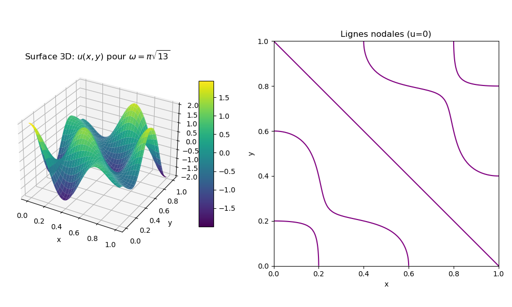
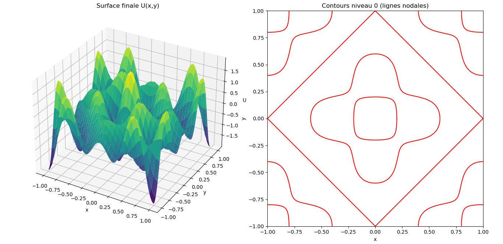
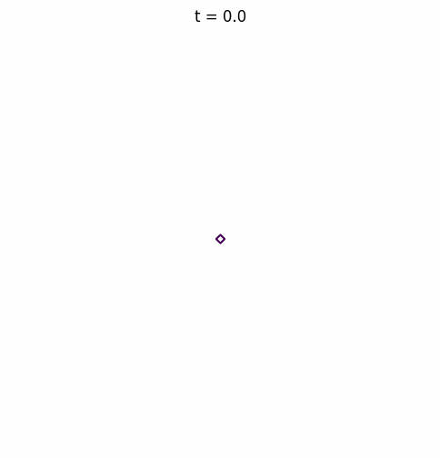
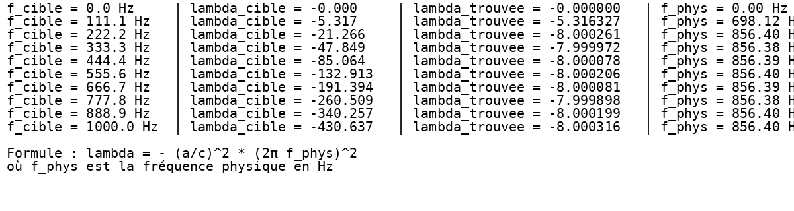
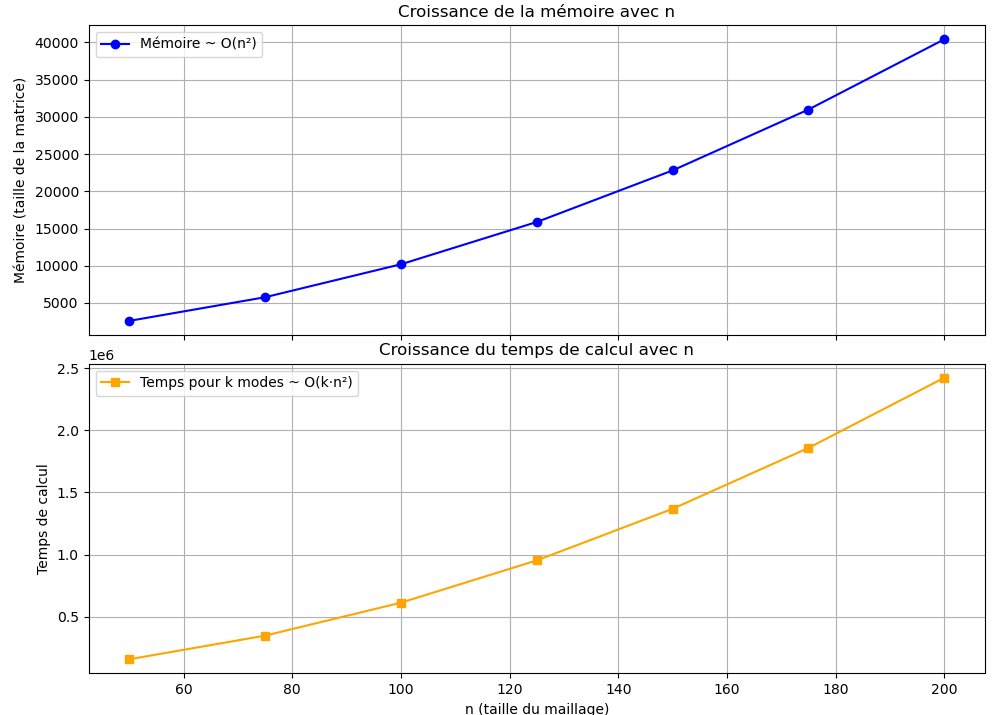
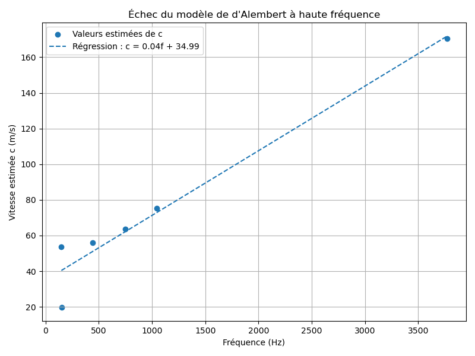
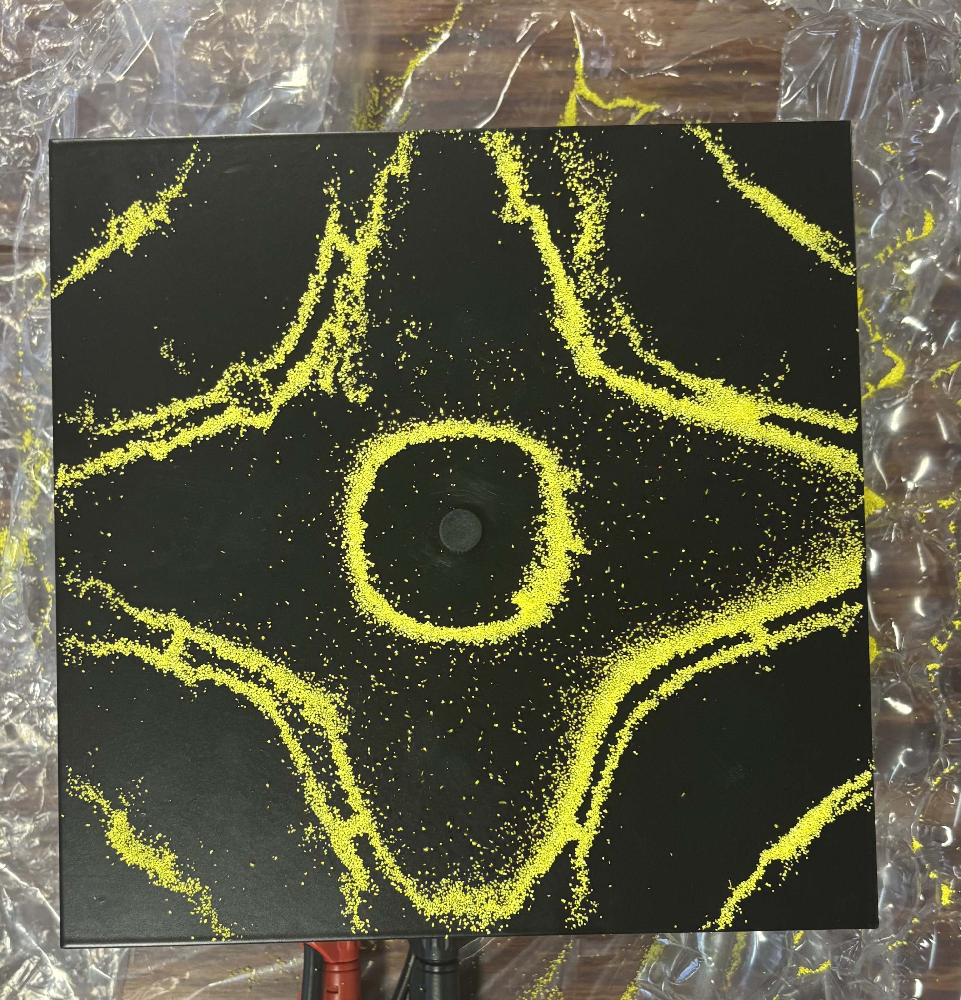

# Study of Chladni Patterns on a Free-Edge Rectangular Plate

**Project period:** 2024–2025 
TIPE – Preparatory Classes (Mathematics & Physics, France)

---

## Overview

This project investigates vibration modes of a rectangular plate with free boundary conditions.

The objective was to predict resonance frequencies and mode shapes using:

- Analytical modeling (d'Alembert wave equation)
- Numerical approximation (finite difference method)
- Forced vibration analysis
- Spectral analysis via eigenvalues
- Experimental validation

Particular attention was given to resonance phenomena and to the physical and numerical limitations of the simplified model.

---

## Documentation

- 📄 [TIPE Presentation (in french)](report/TIPE_presentation.pdf)
- 📊 Simulation results available in `/results`
- 🧪 Experimental validation in `/experiments`

---

# 1. Wave Equation Modeling (d'Alembert Formulation)

The transverse vibration of the plate was modeled using the 2D wave equation.

## 1.1 Analytical Steady-State Solution

An analytical formulation was derived to predict steady-state vibration modes for resonant frequencies.

Below is the 3D spatial mode shape and the corresponding nodal lines for:

ω = π√13

---

## 1.2 Numerical Approximation – Finite Difference Method

The wave equation was discretized using a finite difference scheme to validate the analytical model and extend it to more general cases.

The steady-state numerical solution is shown below.

Small discrepancies are due to discretization error.

---

# 2. Forced Wave Equation and Resonance Phenomena

The model was extended to include external excitation.

The forced wave equation was solved numerically using the same finite difference framework.

## 2.1 Resonant vs Non-Resonant Excitation

Two excitation frequencies were studied:

- Resonant case: ω = π√13
- Non-resonant case: ω = π√6.5

### Resonant Excitation

When the excitation frequency matches a natural frequency of the system, vibration amplitude increases significantly over normalized time.

This illustrates energy accumulation characteristic of resonance.

### Non-Resonant Excitation

For a non-resonant frequency, the vibration amplitude remains bounded and no significant amplification occurs.

---

# 3. Spectral Approach – Eigenvalue Analysis

The discretized plate was reformulated as a matrix system.

Natural frequencies were obtained by computing eigenvalues of the associated operator.

This approach enables:

- Direct computation of vibration modes
- Identification of resonance frequencies
- Comparison with analytical predictions

---

## Limitations of the Spectral Approach

Accessing lower-frequency modes requires increasing the discretization size (N), which significantly increases computational complexity.

With moderate discretization sizes, only higher-frequency eigenvalues are easily accessible.  
However, these high-frequency modes are not physically meaningful in this framework, since the simplified d'Alembert model becomes inaccurate at high frequencies.

This reveals a trade-off between:

- Numerical resolution
- Computational cost
- Physical validity of the model

---

# 4. Computational Complexity

The computational cost of eigenvalue computation was analyzed as a function of matrix size.

This highlights scalability limitations of direct eigenvalue methods.

---

# 5. High-Frequency Model Limitations

At higher frequencies, discrepancies between analytical predictions and numerical/experimental results become significant.

The simplified wave model is no longer accurate for complex vibration modes, illustrating the limits of theoretical assumptions.

---

# Experimental Validation

Physical experiments were conducted on a vibrating rectangular plate with free boundary conditions.

Observed Chladni patterns were compared with theoretical and numerical predictions.
As an illustration, the experimental Chladni pattern obtained at **1047 Hz** 
is presented on the **left**, whereas the pattern corresponding to 
**751.769 Hz** appears on the **right**. 

  
  

---

# Tools

- Python
- NumPy
- Matplotlib
- Finite difference discretization
- Linear algebra (eigenvalue computation)

---

## Author

VIGNESWARAN SUBHEN
Engineering Student – Electronics & Embedded Systems
